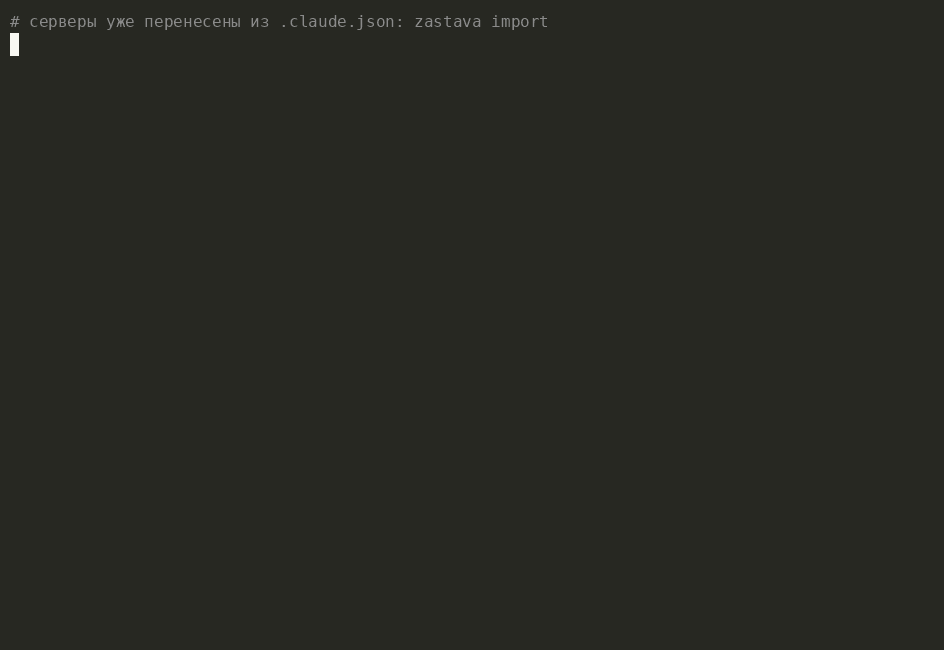

# zastava

[](https://github.com/gorka2354/zastava/actions/workflows/ci.yml)
[](https://crates.io/crates/zastava)
[](LICENSE)


Застава — пограничный пункт досмотра для AI-агентов: single-binary MCP-гейтвей,
который агрегирует ваши MCP-серверы за одним endpoint и добавляет то, чего не
умеет клиентский `permissions.allow`.

Клиент умеет решать «инструмент можно или нельзя». Застава решает **на каких
аргументах**:

```toml
# «github можно, но только в мой репозиторий»
[[policy.allow]]
sig = "github__create_issue"
args = { repo = "gorka2354/zastava" }

# «файлы читать можно, но только в этом проекте»
[[policy.allow]]
sig = "fs__read_file"
args = { path = { prefix = "C:/work/zastava" } }
```

Что ещё:

- **аудит-лог** каждого вызова инструмента — с канонизованными аргументами
  (открыто пишутся только ключи-идентификаторы, всё остальное — хэшем);
- **`zastava learn`** — черновики правил из наблюдаемого поведения вместо
  ручного YAML, включая аргументные;
- **`zastava annotate`** — оценка срабатывания в момент события;
- **переносимость политик** между клиентами (Claude Code, Cursor, …).

Позиционирование выверено экспериментально — см. `spike/SPIKE.md`: контрольное
плечо показало, что tool-level тишину клиент даёт и без гейтвея, поэтому
Застава не притворяется «глушителем промптов».



Запись настоящая: filesystem-MCP с доступом ко всей папке проекта, правило
сужено руками до `notes/`, и следующий заход в `.secrets/` уже не проходит.

## Быстрый старт

Правила не пишутся с нуля — они вырастают из журнала:

```bash
cargo install zastava

zastava import                  # перенести серверы из .claude.json
zastava check                   # валидация конфига и план политик
# в клиенте: {"mcpServers": {"zastava": {"command": "zastava", "args": ["run"]}}}

# поработали день в режиме warn (дефолт — только наблюдение)
zastava stats                   # что происходило
zastava learn                   # черновики правил, включая аргументные
zastava annotate ev-42 "этот deny спас от записи в чужой репозиторий"
# вычеркнули лишнее, вставили в zastava.toml, включили mode = "enforce"
```

`zastava allow <sig>` дописывает правило в конфиг, а работающий гейтвей
подхватывает его без перезапуска MCP-сессии.

## Как это работает

```
Claude Code ──stdio──> zastava ──┬──> github MCP
                                 ├──> filesystem MCP
                                 └──> qdrant MCP
                          │
                          ├── policy: аргументные матчеры (warn | enforce)
                          └── journal: JSONL, append-only
```

Инструменты выдаются клиенту с неймспейсом (`github__create_issue`), ресурсы
маршрутизируются по URI-владельцу, промпты — по префиксу имени.

## Сколько это стоит

Замеры: `cargo bench -p zastava --bench latency`. Настоящие процессы и
настоящие stdio-пайпы с обеих сторон, база сравнения — тот же вызов того же
сервера напрямую, без Заставы. Ниже — медианы 15 запусков и 2000 вызовов.

| | Linux¹ | Windows² |
|---|---|---|
| вызов инструмента, p50 | **+60 мкс** | **+125 мкс** |
| вызов инструмента, p99 | +93 мкс | +193 мкс |
| старт, 1 сервер | 5.9 мс | 73 мс |
| старт, 4 сервера | 6.7 мс | 230 мс |
| худший вызов во время reload политики | +0.15 мс | +0.17 мс |

<sup>¹ Ryzen 7 7735HS, Ubuntu 24.04 · ² Ryzen 9 7950X3D, Windows 11 Pro</sup>

Что за этими цифрами:

- **Вызов.** Десятки микросекунд на вызов инструмента, который сам работает
  миллисекунды и секунды. Отдельного «режима без политик» ради скорости не
  нужно — экономить тут нечего.
- **Старт.** Гейтвей поднимает все downstream'ы параллельно и отвечает
  клиенту, только когда они готовы, — на Linux четвёртый сервер добавляет к
  старту 0.7 мс. На Windows та же четвёрка стоит 230 мс, и это не наш код:
  цена — обёртка `JobObject`, которой на Windows держится гарантия убийства
  всего дерева процессов. Контрольная проба (обёртка снята) даёт 4 мс вместо
  60 мс на сервер. Обёртка остаётся: терять убийство дерева ради 200 мс
  один раз за сессию — плохой обмен. Один общий Job на весь гейтвей вместо
  Job на процесс — задача v0.2.
- **Reload.** Смена политики на живом гейтвее не ощущается: за 3 секунды
  переключения худший вызов оказался дороже обычного на 0.15 мс.

Если старт тормозит — `zastava run` печатает `spawn_ms`/`ready_ms` по каждому
серверу: обычно виноват не гейтвей, а `npx`, который поднимается полсекунды.

## Что попадает в журнал

Аргументы вызова — это и содержимое файлов, и токены, поэтому целиком они не
пишутся никогда (пока явно не включить `log.log_args`). Открыто сохраняется
только `canonical_subset`: значения ключей-идентификаторов из whitelist
(`repo`, `path`, `collection`, …), с усечением путей до нескольких компонентов,
URL — до схемы и хоста, и с отказом от значений, похожих на секрет. Всё
остальное представлено `args_hash`.

Включённый `log.log_args` пропускает аргументы через маскировку: значения под
секретными ключами (`token`, `password`, `authorization`, …), значения вида
токена под любым ключом и учётные данные в URL заменяются на `<masked>`,
слишком длинные — усекаются. Маскировка эвристическая: она снимает типовой
риск, но не превращает журнал в место, где секретам можно лежать.

## Чем это не является

**Это не «просто прокси на tower».** Соблазн понятен — но `tower` описывает
поток «запрос → ответ», а MCP по stdio так не устроен: сервер шлёт
уведомления о прогрессе и об изменении списка инструментов вне пары
запрос-ответ, а Застава одновременно и сервер (для клиента), и клиент (для
downstream'ов), с отдельным жизненным циклом на каждый дочерний процесс.
Протокольный слой уже есть в [rmcp](https://github.com/modelcontextprotocol/rust-sdk);
`Service<Request>` поверх него не несёт ни неймспейсинга, ни обратного
канала, ни убийства дерева процессов — то есть ровно того, из чего состоит
эта задача.

**Это не enterprise-гейтвей.** Соседи по названию решают соседние задачи:
[Microsoft MCP Gateway](https://github.com/microsoft/mcp-gateway) — reverse
proxy для Kubernetes с Entra ID и RBAC на много пользователей;
[Docker MCP Gateway](https://github.com/docker/mcp-gateway) — контейнер на
каждый сервер, allow-листы инструментов и секреты, требует Docker Desktop;
[Bifrost](https://github.com/maximhq/bifrost) — self-hosted AI-гейтвей поверх
десятков провайдеров, MCP там одна из возможностей. Там политика в основном
отвечает на вопрос «кому что можно»; здесь пользователь один, и вопрос
другой — что мой агент сделал на моей машине и на каких аргументах. Отсюда и
разница в цене входа: один бинарник и один TOML против инфраструктуры.

**Это не защита от вредоносного MCP-сервера.** Застава верит серверу, который
вы сами прописали в конфиг: она ограничивает, что агент может у него
*попросить*, и записывает, что он попросил. Проверки подлинности сервера
(подписи, реестр, песочница) в MVP нет — см. «Статус».

## Статус

- [x] Spike: rmcp server+client в одном процессе, агрегация, неймспейсинг,
      живой Claude Code через прокси (`spike/`)
- [x] M0: workspace, `zastava check` (fail-closed конфиг), CI win+linux
- [x] M1: рабочий гейтвей — агрегация с неймспейсингом, policy-пайплайн
      (warn/enforce), аудит-журнал, живой reload правил, `stats` / `allow` /
      `learn` / `import` / `--passthrough`. Пройдено два независимых
      adversarial-ревью (3 P1 + 11 P2 закрыты с регрессионными тестами).
- [x] M2-lite: ресурсы и промпты проксируются и аудируются; возможности
      вычисляются из реальных downstream'ов
- [x] M3: аргументные матчеры (`exact` / `prefix` / `any_of`, `deny_extra_args`),
      канонизация журнала, `learn` с аргументными правилами, `annotate`,
      аудит ослабления политики на reload
- [x] M2-full: прогресс и `list_changed` от downstream'ов доходят до клиента,
      обратные запросы сервера отклоняются честно, шквал событий не вымывает
      журнал ротацией
- [x] M4: маскировка секретов, замеры на обеих платформах, README
- [x] **0.1.0 опубликован** — `cargo install zastava`

Известные ограничения MVP: только stdio-транспорт (Streamable HTTP — v0.2),
журнал без хэш-цепочки, downstream не перезапускается сам после падения.

## Лицензия

MIT
